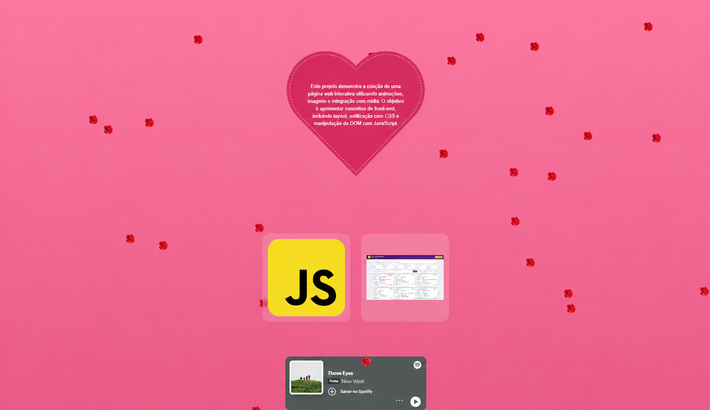

# 🌸 Página Interativa com Animações

Projeto desenvolvido para demonstrar conceitos de front-end, incluindo animações com CSS, manipulação do DOM com JavaScript e construção de layouts responsivos.

## 📸 Preview

## 🚀 Funcionalidades

* Animações com CSS (elementos caindo na tela)
* Layout responsivo
* Galeria de imagens
* Integração com música (Spotify)
* Manipulação dinâmica do DOM com JavaScript

## 🛠️ Tecnologias

* HTML
* CSS
* JavaScript

## ▶️ Como executar

Abra o arquivo `index.html` no navegador.

## 📌 Sobre o projeto

Este projeto foi inicialmente desenvolvido como uma página personalizada para uma ocasião especial e posteriormente adaptado para portfólio, com foco em demonstrar habilidades em desenvolvimento front-end, como animações com CSS, manipulação do DOM e construção de interfaces interativas.

## 👨‍💻 Autor

Ericky Silva
